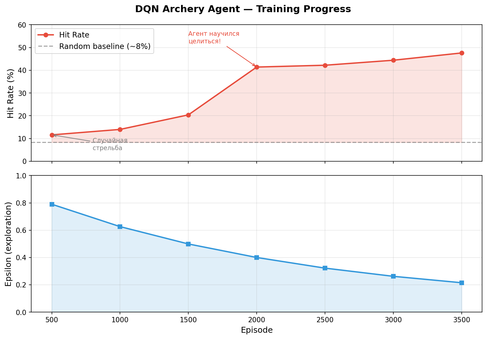
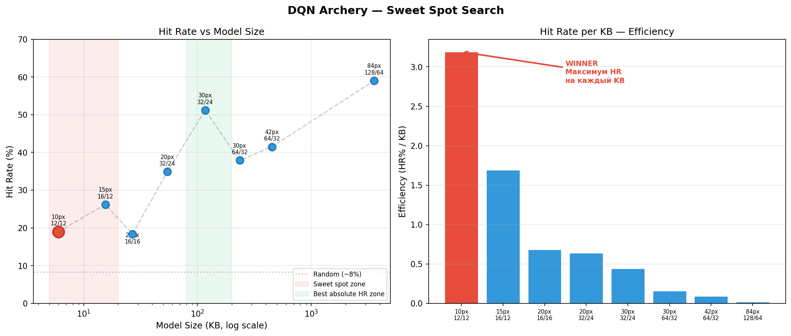
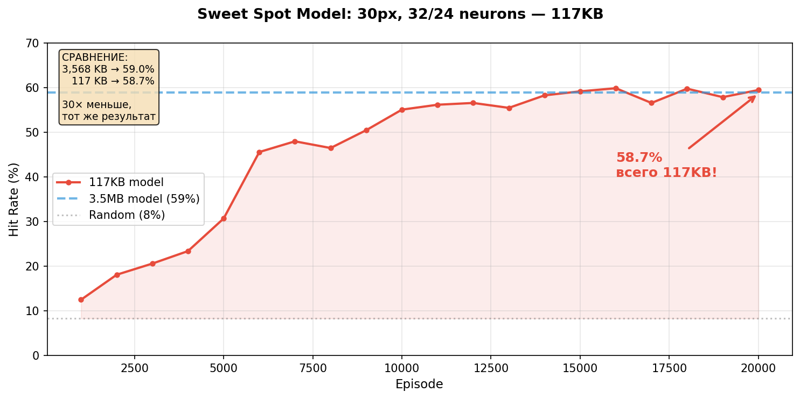

# Archery DQN
# How small can a neural network be and still learn to aim.

A Deep Q-Network that learns to shoot arrows at moving targets from raw pixel input. No hardcoded rules, no heuristics — pure trial-and-error learning. Built from scratch in numpy.

The core question: **what's the minimum model size that achieves near-maximum performance?**

---

## Abstract

Reinforcement learning agents typically operate with large networks and high-resolution inputs. This project asks the opposite question: how far can we compress a DQN while retaining its learned behavior? Starting from a standard 3.5 MB architecture (84×84 input, 128/64 hidden layers), I systematically reduced frame resolution and network width, measuring hit rate against model size across 8 configurations. The result: a **117 KB model** (30×30 input, 32/24 hidden layers) achieves **58.7% hit rate** — within 0.3 percentage points of the full-size model. A 30× reduction in size with no meaningful loss in performance. The remaining gains from 117 KB to 3.5 MB are almost entirely wasted on encoding background pixels the agent never uses.

[<video src="https://github.com/only1morello/archery-dqn/raw/main/agent_evolution.mp4" controls autoplay loop muted width="600"></video>](https://github.com/user-attachments/assets/6eb94fc0-bd52-4d1b-85e5-2d9816d8742e)

---

## The Setup

An archer stands on the left side of a 400×300 pixel canvas. Each episode, a target spawns at a random height on the right. The agent observes a downscaled grayscale frame and selects one of 12 discrete actions (4 angles × 3 force levels). The arrow follows parabolic projectile physics. One shot per episode.

The agent knows nothing at episode 0. It doesn't know gravity exists, what a target looks like, or that arrows fly in arcs. Everything is learned from reward signal alone.

```
State:   30×30 grayscale frame (900 pixels)
Actions: 12 discrete (angle × force combinations)  
Reward:  +10 hit  |  +2 near miss (≤30px)  |  −1 miss
```

## The Network

All components are implemented in pure numpy — forward pass, backpropagation, gradient clipping, weight updates. No autograd, no frameworks. Every operation is explicit.

```
Input (900) → Dense(32) + ReLU → Dense(24) + ReLU → Output (12 Q-values)

Total parameters:  29,516
Model size:        117 KB
Training time:     ~25 seconds (CPU)
```

Training follows the standard DQN recipe: experience replay buffer (50k capacity), target network (synced every 500 steps), epsilon-greedy exploration (1.0 → 0.05 over 3000 episodes), clipped Bellman error as loss.

## Results

### Learning Curve



The agent progresses through three distinct phases:

| Episodes | Hit Rate | Epsilon | Behavior |
|----------|----------|---------|----------|
| 0–2,000 | ~8% | 0.93–0.54 | Random exploration, no learned policy |
| 2,000–8,000 | 8→43% | 0.54–0.12 | Rapid improvement, discovering effective actions |
| 8,000–20,000 | 43–62% | 0.12–0.05 | Fine-tuning, peak 62.5% at episode 17,200 |

---

## The Optimization Experiment

This is the part I actually care about.

Standard DQN implementations feed 84×84 frames into large CNNs because that's what the DeepMind Atari paper did. But our environment is simple — one archer, one target, one background. Does the agent actually need 7,056 pixels and 900,000 parameters to locate a circle on a canvas?

### Method

I trained 8 configurations with varying frame sizes (10px to 84px) and network widths (12/12 to 128/64), keeping all other hyperparameters constant. Each configuration was trained for 8,000–10,000 episodes. The metric: hit rate per kilobyte of model weights.

### Size vs. Performance



```
Config              Params     Size        Hit Rate    HR/KB
──────────────────────────────────────────────────────────────
10px,  12/12 net       1,872      6 KB      19.0%      3.19
15px,  16/12 net       3,852     16 KB      26.2%      1.69
20px,  16/16 net       6,892     27 KB      18.4%      0.68
20px,  32/24 net      13,672     54 KB      34.9%      0.64
30px,  32/24 net      29,516    117 KB      58.7%      0.50  ←
30px,  64/32 net      59,180    235 KB      37.9%      0.16
42px,  64/32 net     114,524    451 KB      41.5%      0.09
84px, 128/64 net     912,140  3,568 KB      59.0%      0.017
```

### Key Findings

**The sweet spot is at 117 KB.** The 30px/32/24 model reaches 58.7% — essentially matching the 3.5 MB baseline (59.0%). Everything beyond 117 KB is encoding sky and grass.

**Bigger networks can perform worse.** The 30px/64/32 model (235 KB) scored 37.9% — lower than the 30px/32/24 (117 KB) at 58.7%. With the same training budget, the larger network couldn't converge. More capacity without proportionally more training is wasted capacity.

**Frame resolution has a hard floor.** At 10×10 pixels, the target is 1–2 pixels wide. The network can detect its presence but not its precise position. Below 20px, no amount of network depth compensates for lost spatial information.

**Diminishing returns are steep.** Going from 6 KB → 117 KB (20× increase) buys 40 percentage points of accuracy. Going from 117 KB → 3,568 KB (30× increase) buys 0.3 percentage points.



---

## Architecture

```
archery-dqn/
├── env/
│   ├── physics.py           — projectile motion (x(t), y(t) with gravity)
│   └── archery_env.py       — environment with gym-like reset()/step() interface
├── agent/
│   ├── replay_buffer.py     — circular buffer, uniform random sampling
│   ├── dqn.py               — MLP with manual forward/backward passes
│   └── trainer.py           — DQN loop: ε-greedy, Bellman targets, gradient updates
├── train.py                 — training entry point
├── plot.py                  — learning curve visualization
└── requirements.txt         — numpy, matplotlib
```

~400 lines of code total.

## Run It

```bash
git clone https://github.com/only1morello/archery-dqn.git
cd archery-dqn
python -m venv venv && source venv/bin/activate
pip install -r requirements.txt

python train.py    # trains in ~25 seconds
python plot.py     # generates learning_curve.png
```

## Bugs That Taught Me Things

**The 48-action experiment.** I expanded the action space from 12 to 48 (8 angles × 6 forces) expecting finer aim. The 48-action model trained for 30,000 episodes and matched the 12-action model's 10,000-episode result exactly: ~60%. Triple the training time, zero improvement. The small network couldn't support 48 output neurons — the output layer alone was larger than the rest of the network. Lesson: action space and network capacity must scale together.

## Limitations

Single-shot episodes (no sequential decision-making). Stationary archer. No wind, no moving targets during flight. Discrete action space limits precision ceiling. MLP instead of CNN — no spatial feature extraction.

A proper next step: continuous actions via DDPG/SAC, moving targets, frame stacking for motion detection, convolutional layers for spatial reasoning.

## What This Is Really About

This isn't a state-of-the-art RL system. It's an exercise in building one from scratch and then asking: how much of it do I actually need? The answer — about 117 KB — was surprising. Most of the standard DQN pipeline (large frames, deep networks, massive replay buffers) exists to handle Atari-level complexity. For a focused task, you can strip it down to almost nothing and still get a network that learned, from pixels, to aim.
